# Amine Mabrouk

**Software engineer in Tunis.** I ship full-stack products — schemas, APIs, UI, the deploy, the 2am pager.

[Portfolio](https://my-portfolio-seven-chi-94.vercel.app) · [Email](mailto:amx72001@gmail.com) · [LinkedIn](https://www.linkedin.com/in/amine-mabrouk) · [GitHub](https://github.com/AmineMabrouk17)

---

### What I actually do

I build products end-to-end. Not "I touched the frontend once" — I mean I designed the schema, wrote the migrations, shipped the API contract, built the UI, set up the deploy pipeline, and got pinged at 2am when something broke.

Day-to-day: **TypeScript / Next.js**, **Angular**, **Laravel**, **Solidity**. I care about the boring parts that make software real — schemas that don't fall over under real data, auth that's actually secure (not "I'll add JWT and call it a day"), and features that work the moment a user clicks them, not three sprints later.

I use AI every day. I'm not pretending otherwise. But I decide what gets abstracted, what gets tested by hand, and where the security boundary lives — not the model.

---

### Currently

- **Building** — [Crypto & Stocks Dashboard](https://crypto-stocks-web-taupe.vercel.app), a real-time market terminal with Binance WS streaming, multi-provider AI chat, and crowd-sourced price predictions.
- **Learning** — by building. Every project I ship teaches me more than a tutorial ever did. My "study plan" is just a repo, a deploy, and a problem I haven't solved yet.
- **Opinionated about** — Cloudflare Workers + D1 for small-to-medium apps. Most teams reach for Postgres + a Node server when a 50ms edge worker would do the same job at 1/10th the cost.

---

### Shipped work

These aren't demo repos. Each one is live, has real users (even if it's just me), and the source is up.

<table width="100%">
  <tr>
    <td width="50%" valign="top">
      <h3>📈 Crypto & Stocks Dashboard</h3>
      
<i>The thing I'm most proud of.</i>

      
Real-time market intelligence terminal — Binance WebSocket streaming, Yahoo Finance quotes, TradingView-style charts, browser-native price alerts, and a multi-provider AI chat assistant (Gemini · Groq · OpenAI · Anthropic) so you're not locked into one vendor.

      
<code>Next.js 16</code> · <code>WebSocket</code> · <code>lightweight-charts</code> · <code>SWR</code> · <code>Turborepo</code>

      

        
        &nbsp;
        
      

    </td>
    <td width="50%" valign="top">
      <h3>⛓️ TrustlessEscrow</h3>
      
<i>On-chain escrow you don't have to trust me on.</i>

      
Trust-minimized escrow state machine with dispute arbitration, deployed on Sepolia. No admin keys, no upgrade path I control, no fees. Read the contract before you read the README — that's the point.

      
<code>Solidity</code> · <code>Foundry</code> · <code>wagmi</code> · <code>viem</code>

      

        
        &nbsp;
        
      

    </td>
  </tr>
  <tr>
    <td width="50%" valign="top">
      <h3>🎬 Cast n Cue</h3>
      
<i>Because Trakt's UX makes me angry.</i>

      
Episode-level watchlist on Cloudflare Workers + D1. TMDB/Trakt search, half-star ratings, private autosaved notes, and a watchlist roulette for when you can't decide what to start next.

      
<code>Next.js</code> · <code>Cloudflare Workers</code> · <code>D1</code> · <code>Better Auth</code>

      

        
        &nbsp;
        
      

    </td>
    <td width="50%" valign="top">
      <h3>💰 BudgetIQ</h3>
      
<i>Open-source, AI-native, actually usable.</i>

      
Budget planner where a conversational Gemini assistant turns "I spent 12 dinars on coffee" into a logged transaction and an updated dashboard. No forms. No friction.

      
<code>Next.js</code> · <code>Supabase</code> · <code>Gemini AI</code> · <code>Recharts</code>

      

        
        &nbsp;
        
      

    </td>
  </tr>
  <tr>
    <td width="50%" valign="top">
      <h3>🛒 E-Commerce Engine</h3>
      
<i>The full storefront, not the demo version.</i>

      
Catalog, cart, Stripe Checkout, verified-only reviews, admin analytics, order fulfillment. The kind of thing agencies charge $30k for, open-sourced.

      
<code>Next.js</code> · <code>Supabase</code> · <code>Stripe</code> · <code>PostgreSQL</code>

      

        
        &nbsp;
        
      

    </td>
    <td width="50%" valign="top">
      <h3>🎮 GameStore TN</h3>
      
<i>Built for the Tunisian gaming scene.</i>

      
Marketplace for gaming accounts — PES/eFootball, Free Fire, etc. — with secure listings and checkout. Local-first because nobody else was doing it.

      
<code>Next.js</code> · <code>Cloudflare Workers</code> · <code>PostgreSQL</code>

      

        
        &nbsp;
        
      

    </td>
  </tr>
</table>

**Smaller experiments:** [ExportLLMExtension](https://github.com/AmineMabrouk17/ExportLLMExtension) · [text2excalidraw](https://github.com/AmineMabrouk17/text2excalidraw) · [MustacharAI](https://github.com/AmineMabrouk17/MustacharAI) · [My-Portfolio](https://github.com/AmineMabrouk17/My-Portfolio)

---

### What I reach for

Not a "tech stack" list — the actual tools I'd pick tomorrow if I had to start a new project.

| For | I'd use | Not because |
|---|---|---|
| Edge-hosted web app | **Next.js + Cloudflare Workers** | Vercel is great until the bill arrives |
| Heavy backend with cron + queues | **Laravel** | Life's too short to write queue boilerplate in Node |
| Anything on-chain | **Foundry + viem** | Hardhat feels like 2021 |
| Real-time dashboards | **WebSocket + SWR + lightweight-charts** | Polling is a smell |
| Quick static sites | **Astro** | Lighthouse 100 isn't optional |

  

---

### GitHub

  
  
    
  

 

  

